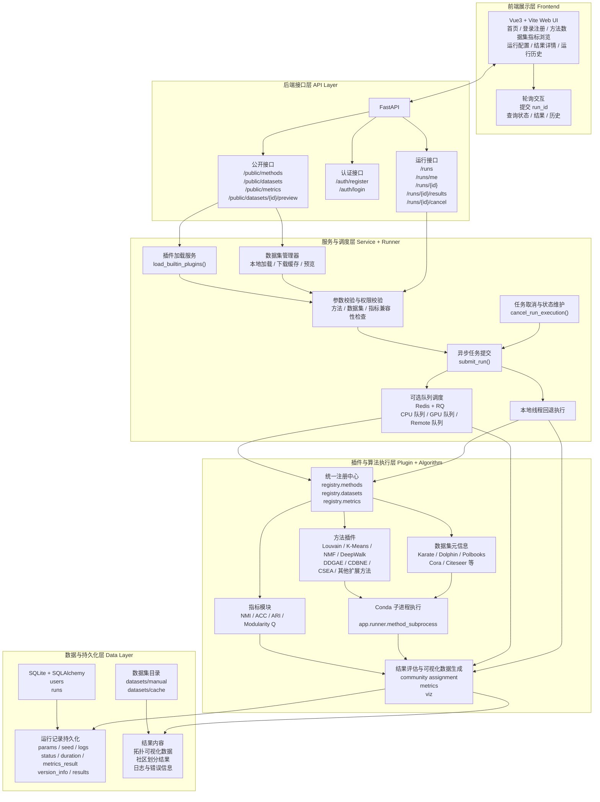

# OpenCDP 总体架构图

本文档根据当前项目代码结构整理 OpenCDP 的总体架构，用于论文、设计说明或后续绘图细化。

样图文件：
- [openCDP-overall-architecture.svg](/home/bishePro/docs/assets/openCDP-overall-architecture.svg)
- [openCDP-overall-architecture-layered.svg](/home/bishePro/docs/assets/openCDP-overall-architecture-layered.svg)
- [openCDP-overall-architecture-colored.svg](/home/bishePro/docs/assets/openCDP-overall-architecture-colored.svg)
- [openCDP-architecture-drawio-nodes.md](/home/bishePro/docs/openCDP-architecture-drawio-nodes.md)

## 1. 总体架构图文本版

## 2. 架构说明

### 2.1 前端展示层

- 技术栈为 `Vue3 + Vite`，核心页面包括首页、登录注册页、方法/数据集/指标浏览页、运行配置页、结果详情页、运行历史页。
- 前端通过 `RESTful API` 与后端交互，运行任务提交后获取 `run_id`，再轮询任务状态与结果。
- 相关目录：
  - `frontend/src/views`
  - `frontend/src/api/client.js`
  - `frontend/src/router/index.js`

### 2.2 后端接口层

- 后端基于 `FastAPI` 构建，统一暴露公开资源、认证和运行任务三类接口。
- 公开接口负责返回方法、数据集、指标以及数据集预览。
- 运行接口负责提交任务、查询状态、查询结果、取消任务和历史记录管理。
- 相关目录：
  - `backend/app/main.py`
  - `backend/app/api/public.py`
  - `backend/app/api/auth.py`
  - `backend/app/api/runs.py`

### 2.3 服务与调度层

- `plugin_loader` 在服务启动时加载内置方法、数据集和指标。
- `dataset_manager` 负责本地数据集读取、下载缓存、预览和标准化输入输出组织。
- 任务提交后由 `submit_run()` 进入异步运行流程。
- 当前实现支持两种调度方式：
  - 优先尝试 `Redis + RQ` 队列执行。
  - 队列不可用时回退到本地线程异步执行。
- 调度阶段同时支持 CPU / GPU 队列区分，以及基于参数的 remote 队列命名。
- 相关目录：
  - `backend/app/services/plugin_loader.py`
  - `backend/app/datasets/manager.py`
  - `backend/app/runner/mock_runner.py`

### 2.4 插件与算法执行层

- 项目通过统一注册中心实现方法、数据集、指标的插件化管理，新增插件时不需要改核心运行主流程。
- 方法插件在执行阶段通过 Conda 子进程运行，兼容不同依赖环境。
- 指标评估模块对社区划分结果进行统一计算，并补充可视化所需的结构化结果。
- 相关目录：
  - `core_modules/registry.py`
  - `core_modules/methods/base.py`
  - `core_modules/methods/plugins.py`
  - `core_modules/methods/metrics.py`
  - `core_modules/datasets/builtin.py`

### 2.5 数据与持久化层

- 当前数据库通过 `SQLAlchemy` 管理，默认使用 `SQLite`。
- `users` 表记录用户信息，`runs` 表记录运行任务核心数据。
- 每次运行都会持久化保存：
  - 方法、数据集、指标与参数
  - 随机种子
  - 状态、耗时、日志
  - 指标结果
  - 版本信息
  - 结果详情与错误信息
- 数据集文件位于 `datasets/manual` 与 `datasets/cache`。
- 相关目录：
  - `backend/app/db.py`
  - `backend/app/models/db_models.py`
  - `datasets/manual`
  - `datasets/cache`

## 3. 可直接用于论文的概括描述

OpenCDP 总体采用“前端展示层、后端接口层、服务与调度层、插件与算法执行层、数据与持久化层”的分层架构。前端基于 Vue3 与 Vite 构建，负责用户登录注册、方法与数据集浏览、运行任务配置、结果展示和历史查询；后端基于 FastAPI 提供统一 RESTful API，并完成认证、参数校验与任务管理；服务与调度层负责插件加载、数据集管理以及异步运行调度，支持 Redis + RQ 队列执行和本地线程回退执行；插件与算法执行层通过统一注册机制组织方法、数据集和指标，并通过 Conda 子进程调用具体算法实现；数据与持久化层基于 SQLAlchemy 和 SQLite 保存用户、运行记录、日志、指标结果、版本信息及可视化结果数据，从而形成完整的社区检测任务闭环。

## 4. 与代码目录的对应关系

| 架构层 | 目录 |
|---|---|
| 前端展示层 | `frontend/src` |
| 后端接口层 | `backend/app/api` |
| 服务与调度层 | `backend/app/services`、`backend/app/runner`、`backend/app/datasets` |
| 插件与算法执行层 | `core_modules` |
| 数据与持久化层 | `backend/app/models`、`backend/app/db.py`、`datasets` |

## 5. 论文插图风格建议

### 5.1 分层框图风格

- 对应文件：
  [openCDP-overall-architecture-layered.svg](/home/bishePro/docs/assets/openCDP-overall-architecture-layered.svg)
- 适合放在“系统总体架构设计”章节。
- 风格接近传统论文中的分层框图，结构清晰，便于在正文中逐层解释。

### 5.2 彩色示意图风格

- 对应文件：
  [openCDP-overall-architecture-colored.svg](/home/bishePro/docs/assets/openCDP-overall-architecture-colored.svg)
- 适合放在章节首页、系统概览页或答辩 PPT。
- 风格更偏平台架构示意图，强调前端、后端、算法执行和存储之间的数据流转。

### 5.3 手工精修节点清单

- 对应文件：
  [openCDP-architecture-drawio-nodes.md](/home/bishePro/docs/openCDP-architecture-drawio-nodes.md)
- 可直接按节点清单在 `draw.io` 或 `Visio` 中重绘。
